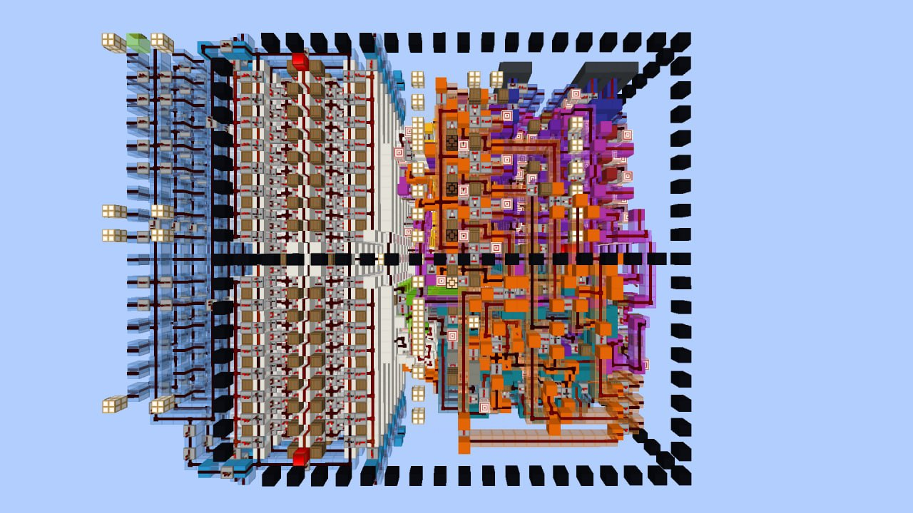
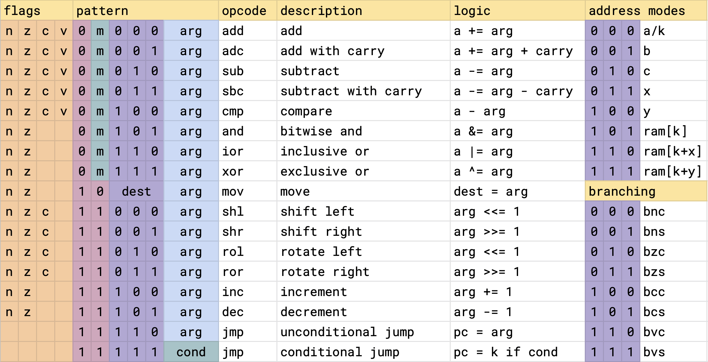

+++
title = "Mira"
+++

Mira is an 8-bit CPU architecture designed to have an efficient implementation in Minecraft completed in September 2021.



## Instruction set

The instruction set architecture (ISA) for the CPU takes inspiration from the 6502 and 8008 microprocessors. The CPU has an accumulator and could be classified as CISC with its variable length instructions and ability to use memory directly as an argument. The feature-rich and orthogonal ISA makes it a joy to write programs for. It features:

- 16 instructions
- Five registers: an accumulator (A) and four general-purpose registers (B, C, X, Y)
- Four condition flags: carry, zero, overflow, and sign
- Five addressing modes: immediate, memory, indexed-memory, registers, and accumulator
- 8-bit variable-length instructions (taking 1-3 bytes)
- 8-bit address space (can use Harvard or Von-Neumann layout, and [bank switching](https://en.wikipedia.org/wiki/Bank_switching) to increase it)
- Memory-mapped I/O



This is the canonical bit-encoding for the ISA. An implementation is free to shift instructions and bits around to decode it more efficiently, as was done for Minecraft. An implementation is considered valid as long as any assembly program can be executed on it.

### Flags

On the left, we have the four processor flags. The presence of a letter in a column indicates whether the instruction updates this flag. The flags can not be written to or read from directly. They are modified as a side effect of other instructions, or read when performing conditional branching.

- `Negative`: Set if bit 7 of the result is set
- `Zero`: Set if the result was zero
- `Carry`: Set if the arithmetic operation produced a carry or borrow. It also holds bits after a shift.
- `oVerflow`: Set if the addition of two like-signed numbers or the subtraction of two unlike-signed numbers produces a result greater than +127 or less than -128.

### Addressing modes

Shifting our attention to the top-right, we have the addressing modes. All instructions with an `arg` field can use one of the addressing modes in this list. Whether `000` refers to the A register or an immediate (K) depends on the "instruction group" (explained in following section).

Mira has 5 registers - A, B, C, X, and Y. Register A (accumulator) functions implicitly as an operand and destination in "Group 0" instructions. B, C, X, and Y serve as general-purpose registers. X and Y can also function as index registers during indexed memory addressing.

Mira lacks a program counter since all jumps use direct addressing which eliminates the need to compute offsets. Function call return addresses are stored as constants and pushed to the stack manually

### Instruction groups

The first two bits of the opcode decode the four instruction groups.

Group 0: Two-operand arithmetic and logical operations. `arg==000` is a `NOP` instruction.

Group 1: Same as group 0, but the `arg` "becomes the accumulator", and the operation is performed with an immediate (a constant stored in the next byte of the program). `arg==000` is the A register.

Group 2: A move instruction that moves the `arg` to a `dest`. `dest/arg==0` is the A register. If `dest==arg`, then `arg` is an immediate. This also supports moving an immediate to memory. Memory to memory moves are not supported by any implementation, but there's nothing intrinsic that would prevent them.

Group 3: Single argument arithmetic and logical operations. `arg==0` is the A register. Shoehorned into this group are the conditional and unconditional jump instructions. For unconditional jumps, `arg==0` is an immediate. Conditional jumps use the conditions in the bottom-right branching table. For example, to branch if the carry flag is set, use `bcs`, for branch if carry clear, use `bcc`. The same goes for the other flags `n,z,v`.

## Minecraft implementation details

The Minecraft implementation features:

- 2Hz clock (5 redstone ticks per cycle)
- 4-stage pipeline
- 32 byte instruction cache
- No data hazards
- One cycle branch penalty
- Executes one instruction byte per cycle
- No program counter: A shift register is built into the instruction cache for advancing the IP
- Harvard memory layout

It also incorporates techniques to reduce the number of updates it causes during program execution, including:

- No clock: The CPU is perfectly synchronized and uses a "Waterfall" pipeline design
- Minimal redstone to reduce game updates
- Directly decoded control lines instead of using a [PLA](https://en.wikipedia.org/wiki/Programmable_logic_array)
- Pre-powered bussing lines

## ISA rationale

> Why no SEC/CLC instructions like the 6502?

The 6502 couldn't inc/dec the accumulator, and it didn't have add/sub without carry instructions. Having these instructions makes SEC/CLC unneeded.

> Why don't INC and DEC update carry flag?

- Preserves the carry flag across iterations in loops
- The N and Z flags can detect rollovers
- x86 does it the same way

> Why no dedicated call/subroutine instructions?

- It is difficult to perform this instruction in 1 cycle which Would violate the 1 cycle per byte objective
- The data path for these instructions is complicated, they require post/pre increment/decrement support on a stack pointer
- Don't want to waste a full register on a stack pointer
- User can decide what calling convention is most efficient
- They can memory-map a stack, allowing for a call in 5 cycles and a return in 2 cycles

> Why no fancy hardware, such as stack, barrel-shifter, multiplier, etc.?

- Complex hardware optimizes for specific instead of general-purpose workloads
- Increases the size of the CPU
- Data paths become more complicated, likely not possible under the current speed constraints
- Trivial to memory-map, which is a much more flexible approach

> Why not use port-mapped I/O?

- Data must move through the accumulator instead of a register directly
- Memory-mapped allows you to use different addressing modes
- Similar to more complex hardware, we want to avoid implementing hardware that some workloads may not need.

> Why an accumulator architecture as opposed to a 3-op load-store?

- Smaller program sizes due to denser instruction set
- Simpler and speedier data loop due to accumulator
- Requires fewer components, lack of dual read registers, register decoders
- A load-store variant would require a 16-bit ISA, increasing instruction cache pressure

## Memory-mapped I/O

Memory-mapped devices are a great way to extend the functionality of the CPU. A device just has to define some interface of reading and writing to designated addresses. Here are some examples:

```
8x16 TTY Screen
[screen]: read char at cursor, write char to cursor
[flags]: auto-increment, clear, character-set, etc.
[cursor]: the index location of where to write to
7-bit value for location of character, rrrcccc

Ticker tape: for printing streams of decimal values
[ticker]: write a value

Keyboard:
[keyboard]: works as a queue of characters
[flags]: blocking/non-blocking read

Multiplier 8x8=16
[multiplicand]: Write multiplicand, read lower byte of product
[multiplier]: Write multiplier, read upper byte of product

Divider 8/8=(8,8) 
[dividend]: Write dividend, read quotient
[divisor]: Write divisor, read remainder
```

## Assembler

I wrote an assembler in Rust.

### Assembler directives

```asm
.str    "hello"
.strz   "hello" ; null-terminated string
.u8     5       ; define 8 bit integer
.i16    32      ; define a signed 16-bit integer
.u8     32, 26  ; define a list of unsigned 32-bit integers
```

### Addressing modes

```asm
jmp $0x01   ; jump to the address stored at memory address 0x01
jmp 0x01    ; jump to the address 0x01
jmp label   ; jump to label or ram address
jmp B       ; jump to the value stored in register B

add $0x05   ; add the value stored at memory address 0x05
add 0x05    ; add the value 0x05

add A, arr[1]   ; add the value at memory[arr+1] to A
```

## Example programs

```asm
; Countdown program
; Print A..=0 to the TICKER device
; input a: the starting count

        mov a, 10       ; move the decimal constant 10 to A
loop:   mov TICKER, a   ; write value in A to the ticker device
        dec a           ; decrement the value in A, updating the flags
        bnc loop        ; Branch to label "loop" while A is not negative


; Array sum
; input: x = length of the array minus 1
; result: sum in A
arr:    .i8 1, 0, 2, 5, -2, 4 
        mov x, 5        ; store length of array minus 1 in X
loop:   add arr[x]      ; add the value at memory address [arr+x]
        dec x           ; decrement X register
        bnc loop        ; while x >= 0, goto loop


; Count set bits (popcnt) (5 bytes)
; input: B, C=0
; result: A
loop:   adc c       ; add the carry flag to the accumulator
start:  shr b       ; shift LSB into carry flag
        bne loop    ; loop while b != 0
        adc c       ; dont forget final bit


; 8x8=8 multipy (7 bytes)
; multiplicant in b
; multiplier in c
; output in a
do_add: add b
loop:   shl b
start:  shr c       ; is multiplier odd?
        bcs do_add  ; add the multiplicand
        bne loop    ; else loop while bits remaining in multiplier


; Collatz conjecture (14 bytes)
; starting value in A
loop:   mov TICKER, a   ; print value
        shr a           ; divide by 2
        bzs end         ; if we hit 0 we're done
        bcc loop        ; loop while even
        rol a           ; restore true odd value
        mov b, a        ; compute a = 3a+1
        shl a
        add b
        inc a           ; a = 3a+1 at this point
        jmp loop
end:


; u8 insertion sort
arr:    .u8 8, 6, 4, 10, 36, 23, 48, 12, 42, 5

        mov c, 9        ; length of array minus one

outer:  mov b, arr[x+1]
        mov y, x

inner:  mov a, arr[y]
        cmp b
        bcc next
        mov arr[y+1], a
        dec y
        bpl inner

next:   mov arr[y+1], b
        inc x
        dec c
        bne outer
```

## Calling convention

The calling convention isn't strict and up to the user. My preference is for the stack to grow downward with post-decrement for push. Here's an example implementation of that

```asm
- post-decrement stack for push
- pre-increment for pop
- PC pushed first, then function args in reverse order


; def my_func(a, b):
;     return a - b

my_func:
    mov a, [sp+1]    ; access 1st arg
    sub [sp+2]       ; access 2nd arg

    ; despite being accumulator, we can add imm constants
    ; to registers, handy for collapsing stack frame
    add sp, 3        ; num args + 1 for pc
    jmp [sp]         ; return


; my_func(3, 5)
    ; push the program counter
    mov [sp], PC
    dec sp

    ; push args in reverse order
    mov [sp], 5      ; can push imm/reg directly
    dec sp
    mov [sp], 3
    dec sp
    jmp my_func      ; call
```
