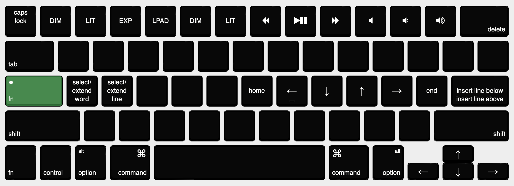

+++
title="Uncapping caps lock"
+++

I remapped the `capslock` key on my macbook pro to `fn` and bound several useful shortcuts to it.



_made with [keyboard-layout-editor.com](https://keyboard-layout-editor.com)_

The number row turns into the original mac function keys (no siri or spotlight), namely screen brightness, mission control, launchpad, keyboard brightness, playback controls, and volume. These are especially useful for macs afflicted with touchbars.

Along the homerow, I placed keys which are mapped to a shortcut, to a sequence of keys to achieve a more complex operation

- select word: `right; opt+left; shift+opt+right`
- extend word: `shift+opt+right`
- select line: `cmd+left; shift+cmd+right`
- extend line: `shift+down; shift+cmd+right`
- insert line below: `cmd+right; return`
- insert line above: `cmd+left; return; up`
- home: `cmd+left`
- end: `cmd+right`
- delete: `fn+backspace`

## How I did it

I used [Karabiner-Elements](https://karabiner-elements.pqrs.org), a keyboard customization program for macOS. Bindings are configured tediously with a json file. For example, here's the config for select/extend word:

```json
{
    "description": "a = select word",
    "type": "basic",
    "from": {"key_code": "a", "modifiers": {"mandatory": ["fn"]}},
    "to": [
        {"key_code": "right_arrow"},
        {"key_code": "left_arrow", "modifiers": ["option"]},
        {"key_code": "right_arrow", "modifiers": ["shift", "option"]},
        {"set_variable": {"name": "word_pressed", "value": 1}}
    ],
    "conditions": [
        {"type": "variable_if", "name": "word_pressed", "value": 0}
    ]
},
{
    "description": "multi-tap a = extend word selection",
    "type": "basic",
    "from": {"key_code": "a", "modifiers": {"mandatory": ["fn"]}},
    "to": [
        {"key_code": "right_arrow", "modifiers": ["shift", "option"]}
    ],
    "conditions": [
        {"type": "variable_if", "name": "word_pressed", "value": 1}
    ]
},
```

## Installation instructions

1. Install karabiner-elements (`brew install karabiner-elements`)
1. [click here to add](karabiner://karabiner/assets/complex_modifications/import?url=https://raw.githubusercontent.com/cullback/dotfiles/main/karabiner/capslock.json)

Alternatively, copy the file [here](https://github.com/cullback/dotfiles/blob/main/karabiner/capslock.json) to `~/.config/karabiner/assets/complex_modifications/`

## Further reading

- https://getreuer.info/posts/keyboards/select-word/index.html
- http://capslock.vonng.com/
- [Karabiner-elements key codes](https://github.com/pqrs-org/Karabiner-Elements/blob/main/src/apps/SettingsWindow/Resources/simple_modifications.json)
- https://github.com/mattmc3/keyboard-tools/tree/main/mappings/Karabiner
- https://getreuer.info/posts/keyboards/macros/
- https://getreuer.info/posts/keyboards/select-word/index.html
